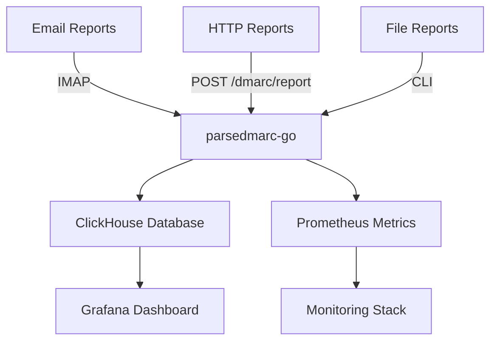

# parsedmarc-go - High-performance DMARC report analyzer

[](https://github.com/ZenProjects/parsedmarc-go)
[](https://golang.org/)
[](https://github.com/ZenProjects/parsedmarc-go/blob/master/LICENSE)

`parsedmarc-go` is a high-performance Go application for parsing and analyzing DMARC reports with native ClickHouse storage and Grafana visualization.
It provides enterprise-grade DMARC report processing with superior performance and simplified deployment.

## Key Features

- **High Performance**: Native Go implementation with concurrent processing
- **Complete DMARC Support**: Parses aggregate, forensic, and SMTP TLS reports
- **Multiple Input Methods**: File processing, IMAP client, and HTTP endpoint
- **ClickHouse Native**: Direct integration with ClickHouse for fast analytics
- **Prometheus Metrics**: Built-in metrics for comprehensive monitoring
- **Simple Deployment**: Single binary with no dependencies
- **TLS Support**: Secure IMAP and HTTP connections
- **Rate Limiting**: Built-in protection against abuse

## Architecture



## Quick Start

### Binary Release
```bash
# Download latest release
curl -L -o parsedmarc-go https://github.com/ZenProjects/parsedmarc-go/releases/latest/download/parsedmarc-go-linux-amd64
chmod +x parsedmarc-go

# Run with config
./parsedmarc-go -daemon -config config.yaml
```

### Docker
```bash
# Run with docker
docker run -d -p 8080:8080 \
  -v $(pwd)/config.yaml:/app/config.yaml \
  parsedmarc-go:latest
```

## 📚 Complete Documentation Guide

### 🚀 **Getting Started**
1. **[📦 Installation](installation.md)** 
   - Binary installation, Docker, and building from source
   - Prerequisites setup (Go, ClickHouse, MaxMind)
   - Quick setup in 5 minutes

2. **[⚙️ Configuration](configuration.md)**
   - Complete configuration file with examples
   - Environment variables and CLI parameters
   - IMAP, HTTP, ClickHouse, and monitoring configuration

### 🔧 **Usage**  
3. **[💡 Usage Guide](usage.md)**
   - File and directory processing
   - Daemon mode (IMAP + HTTP)
   - Output formats and advanced options

4. **[🌐 HTTP API](api.md)**
   - Report submission endpoints
   - Email provider integrations
   - Authentication and security

### 📊 **Storage and Visualization**
5. **[🗃️ ClickHouse](clickhouse.md)**
   - Optimized database schema
   - Analysis and reporting queries
   - Performance and optimizations

6. **[📊 Grafana](grafana.md)**
   - Dashboard installation and configuration
   - Pre-configured visualizations
   - Customization and alerting

### 📈 **Production and Monitoring**
7. **[📈 Monitoring](monitoring.md)**
   - Detailed Prometheus metrics  
   - Health checks and observability
   - Alerting and surveillance

8. **[📧 Mailing Lists](mailing-lists.md)**
   - SMTP configuration for reports
   - Integration with notification systems

### 📖 **Reference**
9. **[🔒 DMARC Standards](dmarc.md)**
   - Detailed RFC specifications
   - Supported report formats
   - Compatibility and extensions

10. **[🤝 Contributing](contributing.md)**
    - Code contribution guide
    - Development standards
    - Testing and continuous integration

---

## 🎯 Recommended Learning Paths

### 👨‍💻 **For Developers**
Installation → Configuration → Usage → API → Contributing

### 🔧 **For System Administrators**  
Installation → Configuration → ClickHouse → Monitoring → Grafana

### 📊 **For Security Analysts**
Usage → ClickHouse → Grafana → DMARC Standards

### ⚡ **Quick Start (5 min)**
[Quick Installation](installation.md#quick-setup) → [First Test](usage.md#quick-test)

## Support

- **Documentation**: Complete guides and examples
- **GitHub Issues**: Bug reports and feature requests
- **Community**: Join discussions on best practices
- **Migration Guide**: Step-by-step migration from Python version

[GitHub Repository]: https://github.com/ZenProjects/parsedmarc-go
[ClickHouse]: https://clickhouse.com/
[Grafana]: https://grafana.com/
[Prometheus]: https://prometheus.io/