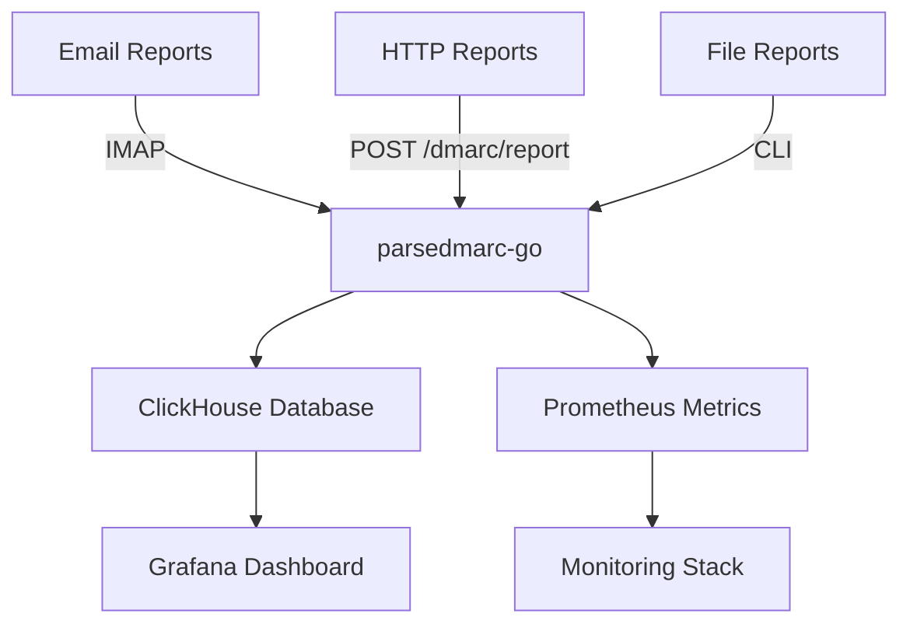

# parsedmarc-go - High-performance DMARC report analyzer

[](https://github.com/domainaware/parsedmarc-go)
[](https://golang.org/)
[](https://github.com/domainaware/parsedmarc-go/blob/master/LICENSE)

`parsedmarc-go` is a high-performance Go application for parsing and analyzing DMARC reports with native ClickHouse storage and Grafana visualization.
It provides enterprise-grade DMARC report processing with superior performance and simplified deployment.

## Key Features

- **High Performance**: Native Go implementation with concurrent processing
- **Complete DMARC Support**: Parses aggregate, forensic, and SMTP TLS reports
- **Multiple Input Methods**: File processing, IMAP client, and HTTP endpoint
- **ClickHouse Native**: Direct integration with ClickHouse for fast analytics
- **Prometheus Metrics**: Built-in metrics for comprehensive monitoring
- **Simple Deployment**: Single binary with no dependencies
- **TLS Support**: Secure IMAP and HTTP connections
- **Rate Limiting**: Built-in protection against abuse

## Architecture



## Quick Start

### Binary Release
```bash
# Download latest release
curl -L -o parsedmarc-go https://github.com/domainaware/parsedmarc-go/releases/latest/download/parsedmarc-go-linux-amd64
chmod +x parsedmarc-go

# Run with config
./parsedmarc-go -daemon -config config.yaml
```

### Docker
```bash
# Run with docker
docker run -d -p 8080:8080 \
  -v $(pwd)/config.yaml:/app/config.yaml \
  parsedmarc-go:latest
```

## Performance Comparison

| Metric | parsedmarc (Python) | parsedmarc-go |
|--------|-------------------|---------------|
| Memory Usage | ~200MB | ~50MB |
| CPU Usage | High (GIL limited) | Low (concurrent) |
| Startup Time | ~5-10s | ~100ms |
| Report Processing | ~100 reports/min | ~1000+ reports/min |
| Binary Size | N/A (+ Python runtime) | ~25MB |

```{toctree}
:caption: 'Contents'
:maxdepth: 2

installation
configuration
usage
clickhouse
grafana
monitoring
api
dmarc
contributing
```

## Support

- **Documentation**: Complete guides and examples
- **GitHub Issues**: Bug reports and feature requests
- **Community**: Join discussions on best practices
- **Migration Guide**: Step-by-step migration from Python version

[GitHub Repository]: https://github.com/domainaware/parsedmarc-go
[ClickHouse]: https://clickhouse.com/
[Grafana]: https://grafana.com/
[Prometheus]: https://prometheus.io/